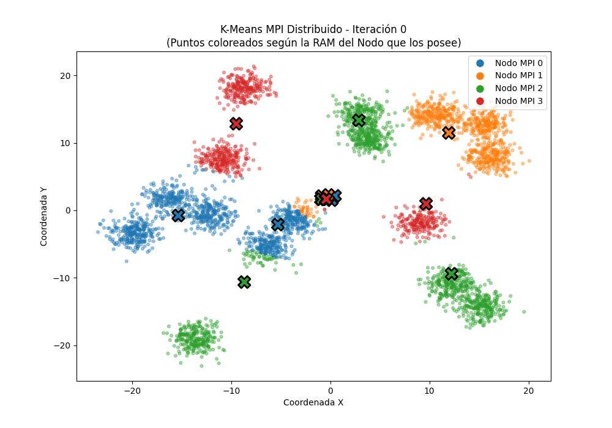

# 🚀 High-Performance Distributed K-Means (C++)


Este proyecto es una implementación de **Altas Prestaciones (HPC)** del algoritmo de clustering K-Means. Diseñado para procesar conjuntos de datos masivos aprovechando arquitecturas de **memoria distribuida (OpenMPI)** y **memoria compartida (OpenMP)**.

## 📊 Rendimiento y Aceleración (Speedup)

El objetivo principal de este proyecto es exprimir al máximo el hardware subyacente. Partiendo de una implementación secuencial base, se han aplicado optimizaciones arquitectónicas severas:

* **Volumen de Datos:** Procesamiento de **8.000.000 de puntos** en **32 dimensiones** (Aprox. 1 GB de RAM en memoria continua).
* **Tiempo Secuencial Base:** ~81.68 segundos.
* **Tiempo Híbrido Optimizado:** **~2.74 segundos** (Media de 10 ejecuciones).
* **Aceleración Total (Speedup):** **~30x**.

### Técnicas de Optimización Aplicadas:
1. **Consciencia de Caché L1/L2:** Uso de vectores contiguos en memoria 1D (`std::vector<float>`) para evitar el *cache-miss* de los punteros dobles y maximizar el pre-fetching.
2. **Metaprogramación (Templates):** Desenrollado de bucles en tiempo de compilación (*Loop Unrolling*) para dimensiones fijas, permitiendo auto-vectorización SIMD profunda (`-O3 -march=native -ffast-math`).
3. **Paralelismo Bulk Synchronous (MPI):** Reducción de la latencia de red agrupando los puntos en "buzones" locales y utilizando comunicación colectiva (`MPI_Alltoallv`, `MPI_Allreduce`) una sola vez por iteración.
4. **Multihilo Seguro (OpenMP):** Uso de buzones privados por hilo (Thread-local storage) y bloques `#pragma omp critical` para evitar *Race Conditions* manteniendo la CPU al 100% de uso.

## 🎥 Simulación de la Arquitectura Distribuida



> **Nota visual:** Esta simulación en 2D muestra el comportamiento real de la red. Los **4 colores** representan las memorias RAM físicas de los **4 Nodos MPI** distintos. A medida que los centroides se mueven, los puntos viajan por la red cambiando de dueño (función `MPI_Alltoallv`) hasta alcanzar el equilibrio matemático.

## 📁 Estructura del Proyecto

```text
📦 HPC-Distributed-KMeans
 ┣ 📂 src/          # Código fuente principal (K-Means distribuido, MPI, Estadísticas)
 ┣ 📂 include/      # Archivos de cabecera (.h)
 ┣ 📂 scripts/      # Utilidades y generadores de datos
 ┣ 📂 data/         # Carpeta de destino para los datasets binarios masivos
 ┣ 📜 Makefile      # Automatización de la compilación
 ┗ 📜 README.md